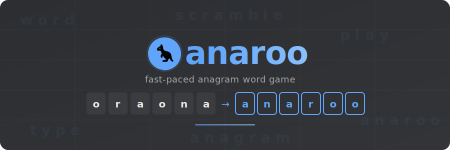

[](#)
[](https://github.com/adtommo/anaroo/releases)
[](https://opensource.org/)
[](LICENSE)
[](CONTRIBUTING.md)
[](https://github.com/adtommo/anaroo/issues)

[](https://www.typescriptlang.org/)
[](https://vitejs.dev/)
[](https://sass-lang.com/)
[](https://vitest.dev/)
[](https://www.cypress.io/)
[](https://storybook.js.org/)
[](https://expressjs.com/)
[](https://www.mongodb.com/)
[](https://redis.io/)
[](https://www.docker.com/)

---

A fast-paced word unscrambling game with timed challenges, infinite survival mode, and daily puzzles. Compete on leaderboards, track your stats, and level up.

## Game Modes

- **Timed** -- Solve as many anagrams as you can before time runs out (30s / 60s / 120s).
- **Infinite Survival** -- Each correct answer keeps you alive; wrong answers cost time.
- **Daily Challenge** -- One word per day, same for everyone.

## Tech Stack

| Layer | Tech |
|-------|------|
| Frontend | React, Vite, TypeScript |
| Backend | Express, TypeScript |
| Database | MongoDB, Redis |
| Testing | Vitest, Cypress, Storybook |
| Deployment | Docker Compose |

## Quick Start

```bash
git clone https://github.com/adtommo/anaroo.git
cd anaroo
./quick-start.sh
```

Or manually:

```bash
npm install
npm run build --workspace=shared
cp backend/.env.example backend/.env
npm run dev
```

See [DEVELOPMENT.md](DEVELOPMENT.md) for the full setup guide.

## Maintenance

This is a personal project maintained on a best-effort basis. It may not be actively developed long-term. Bug reports and feature requests are welcome via [issues](https://github.com/adtommo/anaroo/issues), but there is no guaranteed response timeline.

## Contributing

Pull requests are welcome! Please see [CONTRIBUTING.md](CONTRIBUTING.md) for guidelines.

## License

[GPLv3](LICENSE)
